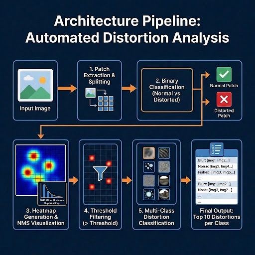
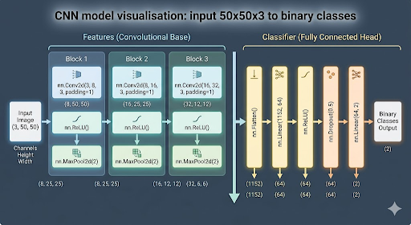
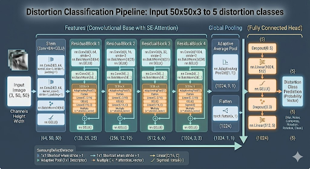

<div align="center">

  <h1>Samsung - Deep Learning Image Artifact Detection & Classification</h1>
  <p><i>Automated Artifact Detection & No-Reference Image Quality Assessment</i></p>

  <p>
    
    
    
    
  </p>

</div>

> [!NOTE]
> This project is under active development in collaboration with **Samsung**.

<br />

## Table of Contents

<details>
  <summary>Click to expand</summary>

  - [The Goal](#the-goal)
  - [Project Overview](#project-overview)
  - [Key Features](#key-features)
  - [Tech Stack](#tech-stack)
  - [Methodology](#methodology)
  - [Getting Started](#getting-started)
    - [System Requirements](#system-requirements)
    - [Installation](#installation)
  - [Results & Evaluation](#results--evaluation)
  - [Team Members](#team-members)

</details>

<br />

## The Goal

A specialized **No-Reference Image Quality Assessment (IQA)** model designed to automatically detect, classify, and quantify image degradation. This project focuses on identifying technical artifacts such as sensor faults and processing errors without requiring a "clean" reference image.

<br />

## Project Overview

In many real-world scenarios, a pristine reference image isn't available. This project implements a Convolutional Neural Network (CNN) approach for real-time image quality evaluation. Developed as part of an initiative to streamline quality control, this tool integrates directly into evaluation pipelines to ensure high-standard visual output.

<br />

## Key Features

| Feature | Description |
|:---|:---|
| **Assessment Mode** | No-reference -input image only |
| **Output** | Distortion category classification |
| **Target Artifacts** | Noise, sensor faults, processing errors |
| **Integration** | Plugs directly into evaluation pipelines |

<br />

## Tech Stack

 **Core**


**Libraries**


<br />


## Methodology

The system employs a multi-stage pipeline to detect, isolate, and classify technical degradations:

<div align="center">



</div>

<br />

**1. Binary Model Training & Weight Generation**
> A primary binary CNN is trained to evaluate the presence of defects across different image patches. The model generates and saves learned weights (`.pth` file) representing defect probabilities.
<div align="center">



</div>


**2. Non-Maximum Suppression (NMS)**
> During inference, confidence scores from the binary model are processed using an NMS algorithm. This step applies a defined threshold to filter redundant points and overlapping boxes, pinpointing exact defect locations.

<div align="center">

| Threshold Filtering | Heatmap Generation & NMS Visualization |
|:---:|:---:|
|  |  |

</div>

**3. Multi-Class Distortion Classification**
> The isolated defect regions are passed to a secondary classification model to determine the specific degradation category (e.g., Smears, Broken Lines, Saturated False Colors).

<div align="center">



</div>


<br />

## Getting Started

### System Requirements

**Hardware**

| Component | Requirement |
|:---|:---|
| **GPU** | NVIDIA with CUDA support -*highly recommended* |
| **CPU** | Supported as fallback (significantly slower) |
| **OS** | Windows, macOS, or Linux |

**Software**

| Component | Requirement |
|:---|:---|
| **Python** | 3.8 or higher required -3.10+ recommended |
| **Environment** | `venv` or `conda` recommended |
| **Package manager** | pip |

<br />

### Installation

**1. Clone the repository**

```bash
git clone https://github.com/Snafuzila/Samsung-Artifact-Detection.git
cd Samsung-Artifact-Detection
```

**2. Install dependencies**

```bash
pip install torch torchvision numpy Pillow matplotlib scikit-image tqdm
```

<br />

## Results & Evaluation

**Model Inference Speed & Hardware Setup**


| Metric | Value |
|:---|:---|
| **Binary Model - Full Image Size** | 8191 × 6140 px |
| **Binary Model - Total Patches** | 497,157 |
| **Binary Model - Total Time** | ~83 seconds |
| **Binary Model - Avg per Patch** | 0.16 ms |
| **Multi-Class Model - Total Time** | ~70 seconds |
| **Multi-Class Model - Avg per Patch** | 11 ms (0.011 sec) |
| **Hardware** | Intel Core i7 11th Gen · NVIDIA RTX 3080 10GB · 32GB RAM |

<br />

## Team Members
<div align="center">
 Instructor
<table>
  <tr>
    <td align="center">
      <a href="https://github.com/shafangadol">
        <br/>
        <sub><b>Apartsin Sasha </b></sub><br/>
      </a>
    </td>
  </tr>
</table>
 Students
<table>
  <tr>
    <td align="center">
      <a href="https://github.com/Snafuzila">
        <br/>
        <sub><b>Attiya Boaz</b></sub>
      </a>
    </td>
    <td align="center">
      <a href="https://github.com/Linoyav2001">
        <br/>
        <sub><b>Avraham Linoy</b></sub>
      </a>
    </td>
    <td align="center">
      <a href="https://github.com/TheLazyPrince">
        <br/>
        <sub><b>Reany Inon</b></sub>
      </a>
    </td>
  </tr>
</table>
<br/>
</div>
